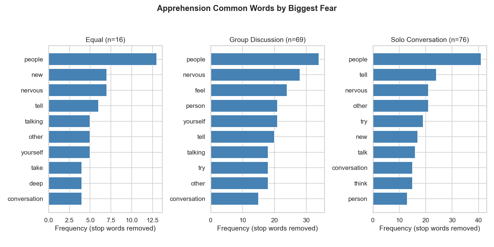

::: {.memo-box}
**TO:** DAGE & Adam Ross Nelson

**RE:** What are the most common words within biggest fear?
:::

After filtering out stop words, by far the most common word in all classes is “people” and “nervous” no matter the fear. An interesting thing to note is that the word “feel” is the 3rd most used word in group discussion, but did not make the top 10 in the other categories.



Approximate frequencies of the top 10 non-stop words per biggest-fear class:

```{python}
import re
from collections import Counter

import numpy as np
import pandas as pd
from IPython.display import Markdown, display

DATA_PATH = "../../data_clean/PRCA_FileC_clean.csv"

STOPWORDS = {
    'a','about','all','also','am','an','and','are','as','at','be','been','being','but','by','can','could','did','do','does','doing','don','dont','for','from','get','go','got','had','has','have','he','her','him','his','how','i','if','in','is','it','its','just','like','ll','m','me','more','much','my','no','not','of','on','one','or','our','out','over','re','s','she','so','some','t','than','that','the','their','them','then','there','they','this','to','too','up','us','use','used','ve','very','was','we','were','what','when','where','which','who','will','with','would','you','your'
}

LIKERT_FORWARD = {
    'Strongly disagree': 1,
    'Somewhat disagree': 2,
    'Neither agree nor disagree': 3,
    'Somewhat agree': 4,
    'Strongly agree': 5,
}
LIKERT_REVERSE = {
    'Strongly disagree': 5,
    'Somewhat disagree': 4,
    'Neither agree nor disagree': 3,
    'Somewhat agree': 2,
    'Strongly agree': 1,
}

FORWARD_CODE = ['Q1', 'Q3', 'Q5', 'Q13', 'Q15', 'Q18']
REVERSE_CODE = ['Q2', 'Q4', 'Q6', 'Q14', 'Q16', 'Q17']
PRCA_COLS = FORWARD_CODE + REVERSE_CODE
GROUP_DISCUSSION = ['Q1', 'Q2', 'Q3', 'Q4', 'Q6']
SOLO_CONVERSATION = ['Q13', 'Q14', 'Q15', 'Q16', 'Q17', 'Q18']


def tokenize(text):
    if pd.isna(text):
        return []
    text = str(text).lower()
    text = re.sub(r'[^\w\s]', ' ', text)
    return [t.strip("'") for t in text.split() if t.strip("'")]


def extract_classes(df):
    df = df.copy()
    for col in FORWARD_CODE:
        df[col] = df[col].map(LIKERT_FORWARD)
    for col in REVERSE_CODE:
        df[col] = df[col].map(LIKERT_REVERSE)
    df['group_apprehension'] = df[GROUP_DISCUSSION].mean(axis=1, skipna=True)
    df['solo_apprehension'] = df[SOLO_CONVERSATION].mean(axis=1, skipna=True)
    fear_cond = [
        df['group_apprehension'] > df['solo_apprehension'],
        df['solo_apprehension'] > df['group_apprehension'],
    ]
    fear_choices = ['Group Discussion', 'Solo Conversation']
    df['biggest_fear'] = np.select(fear_cond, fear_choices, default='Equal')
    return df


df = pd.read_csv(DATA_PATH)
df = extract_classes(df)
ap_df = df[df["Q18.1"].notna() & df[PRCA_COLS].notna().all(axis=1)].copy()

for cls in sorted(ap_df["biggest_fear"].dropna().unique()):
    tokens = ap_df.loc[ap_df["biggest_fear"] == cls, "Q18.1"].astype(str).apply(tokenize)
    all_words = [t for toks in tokens for t in toks]
    content_words = [w for w in all_words if w not in STOPWORDS]
    counter = Counter(content_words)
    top = counter.most_common(10)
    n_cases = len(tokens)
    table_df = pd.DataFrame(top, columns=["Word", "Frequency"])
    table_df.insert(0, "Rank", range(1, len(table_df) + 1))
    header = "| " + " | ".join(table_df.columns) + " |"
    sep = "|" + "|".join(["---" for _ in table_df.columns]) + "|"
    rows = []
    for _, row in table_df.iterrows():
        rows.append("| " + " | ".join(str(v) for v in row) + " |")
    table_md = "\n".join([header, sep] + rows)

    display(
        Markdown(
            f"**{cls} (n = {n_cases})**\n\n" + table_md
        )
    )
```

::: {.conclusion-box}
**Future questions:** Analyze the predictive power of the word "feel" and test how much adding or removing it from a model improves or decreases predictive power.
:::
