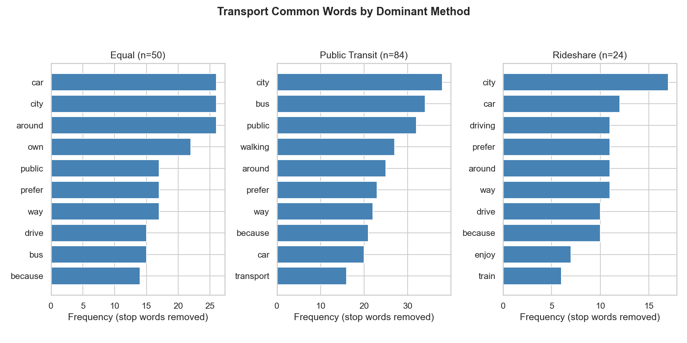

::: {.memo-box}
**TO:** DAGE & Dr. Adam Ross Nelson

**RE:** What are the most common words in each transport method?
:::

EDA was performed to determine that, given the most preferred transport methods, what are the most common words for each class.

After filtering out stop words, the most common words across the classes seem similar across the classes except for public transit, which has "bus" as a highly common word and is most likely to be a stronger predictor. While words like "city" would likely be a weak predictor since it is common no matter the class.



Approximate frequencies of the top 10 non-stop words per dominant transport method:

```{python}
import re
from collections import Counter

import numpy as np
import pandas as pd
from IPython.display import Markdown, display

DATA_PATH = "../../data_clean/PRCA_FileC_clean.csv"

STOPWORDS = {
    'a','about','all','also','am','an','and','are','as','at','be','been','being','but','by','can','could','did','do','does','doing','don','dont','for','from','get','go','got','had','has','have','he','her','him','his','how','i','if','in','is','it','its','just','like','ll','m','me','more','much','my','no','not','of','on','one','or','our','out','over','re','s','she','so','some','t','than','that','the','their','them','then','there','they','this','to','too','up','us','use','used','ve','very','was','we','were','what','when','where','which','who','will','with','would','you','your'
}

USAGE_MONTHLY = {
    'Never': 0,
    '0-1 days a month': 1,
    '2-4 days a month': 3,
    '4-8 days a month': 6,
    '8 or more days a month': 8,
}
USAGE_DAILY = {
    '1-2 rides in a typical day': 1.5,
    '3-4 rides in a typical day': 3.5,
    '5-6 rides in a typical day': 5.5,
    '7 or more rides in a typical day': 7,
}
TRANSPORT_COLS = ['Q26', 'Q27', 'Q28', 'Q29']


def tokenize(text):
    if pd.isna(text):
        return []
    text = str(text).lower()
    text = re.sub(r'[^\w\s]', ' ', text)
    return [t.strip("'") for t in text.split() if t.strip("'")]


def extract_classes(df):
    df = df.copy()
    df['q26_num'] = df['Q26'].map(USAGE_MONTHLY)
    df['q27_num'] = df['Q27'].map(USAGE_DAILY)
    df['q28_num'] = df['Q28'].map(USAGE_MONTHLY)
    df['q29_num'] = df['Q29'].map(USAGE_DAILY)
    df['public_transit_count'] = df['q26_num'] * df['q27_num']
    df['rideshare_count'] = df['q28_num'] * df['q29_num']
    trans_cond = [
        df['public_transit_count'] > df['rideshare_count'],
        df['rideshare_count'] > df['public_transit_count'],
    ]
    trans_choices = ['Public Transit', 'Rideshare']
    df['highest_transport'] = np.select(trans_cond, trans_choices, default='Equal')
    return df


df = pd.read_csv(DATA_PATH)
df = extract_classes(df)
tr_df = df[df["Q19"].notna() & df[TRANSPORT_COLS].notna().all(axis=1)].copy()

for cls in sorted(tr_df["highest_transport"].dropna().unique()):
    tokens = tr_df.loc[tr_df["highest_transport"] == cls, "Q19"].astype(str).apply(tokenize)
    all_words = [t for toks in tokens for t in toks]
    content_words = [w for w in all_words if w not in STOPWORDS]
    counter = Counter(content_words)
    top = counter.most_common(10)
    n_cases = len(tokens)
    table_df = pd.DataFrame(top, columns=["Word", "Frequency"])
    table_df.insert(0, "Rank", range(1, len(table_df) + 1))
    header = "| " + " | ".join(table_df.columns) + " |"
    sep = "|" + "|".join(["---" for _ in table_df.columns]) + "|"
    rows = []
    for _, row in table_df.iterrows():
        rows.append("| " + " | ".join(str(v) for v in row) + " |")
    table_md = "\n".join([header, sep] + rows)

    display(
        Markdown(
            f"**{cls} (n = {n_cases})**\n\n" + table_md
        )
    )
```

::: {.conclusion-box}
**Future questions:** How much predictive power does the word "bus" add to a model?

**Conclusion:** "City" and "car" would not add value to the prediction model, while the word "bus" would help predict the public transportation class.
:::
